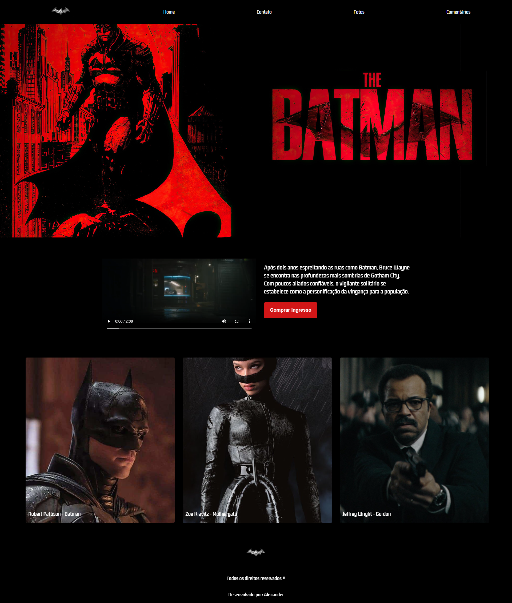

<h1 align="center">The Batman - Site de Venda de Ingressos</h1>

Este é um projeto aberto. Confira a seguir informações relevantes sobre ele. 

  <a href="#-tecnologias">Tecnologias</a>&nbsp;&nbsp;&nbsp;|&nbsp;&nbsp;&nbsp;
  <a href="#-projeto">Projeto</a>&nbsp;&nbsp;&nbsp;|&nbsp;&nbsp;&nbsp;
  <a href="#-instruções">Instruções</a>&nbsp;&nbsp;&nbsp;|&nbsp;&nbsp;&nbsp;
  <a href="#memo-licença">Licença</a>

  

 

  

## 🚀 Tecnologias

Esse projeto foi desenvolvido com as seguintes tecnologias:

- HTML
- CSS

## 💻 Projeto

O site foi projetado para simular uma plataforma de venda de ingressos para o filme *The Batman*. Ele inclui diversas seções e elementos estilizados que tornam a experiência visual envolvente, mesmo sem funcionalidades interativas. 

## 🎯 Objetivo

Este projeto é um exercício de desenvolvimento frontend focado no uso de HTML e CSS, explorando práticas de design, organização de código e responsividade.

- [Acesse o projeto finalizado, online](https://alex518123.github.io/alexdeveloper/)

## 📝 Instruções

### Clonando o repositório

Abra o terminal do seu sistema operacional e navegue até o diretório onde deseja clonar o repositório.

Digite o seguinte comando para clonar o repositório:

`git clone https://github.com/alex518123/alexdeveloper.git`

### Executando o projeto

Caso esteja usando o VS Code, instale a extensão "Live Server". Após a instalação, clique com o botão direito do mouse no arquivo "index.html" e escolha a opção "Open With Live Server".

## Conclusão:

Pronto! Agora você pode clonar e executar o projeto em sua máquina. Caso tenha alguma dúvida ou problema, sinta-se à vontade para abrir uma issue em nosso repositório.

## :memo: Licença

Esse projeto está sob a licença MIT.

---

Desenvolvido por: Alexander Resende [Dê uma olhada no meu portfólio!]()